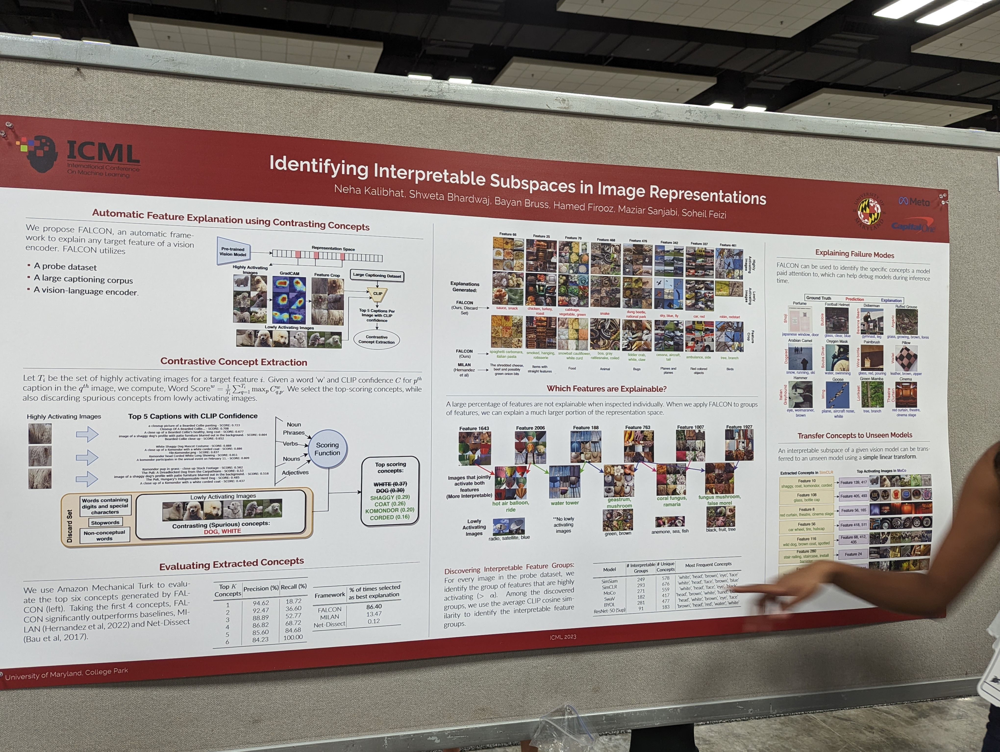
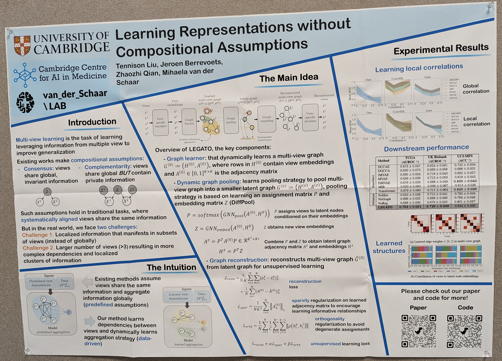
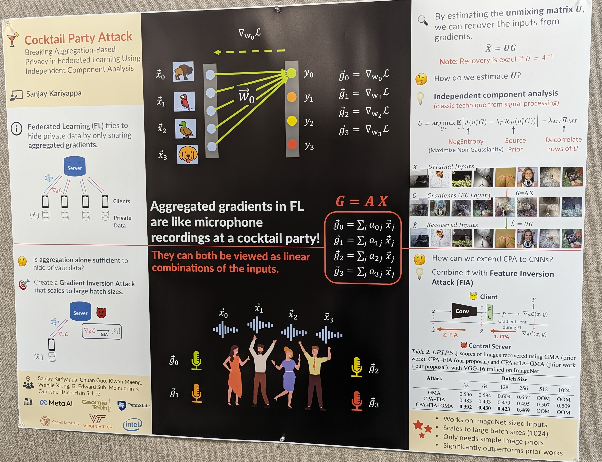

## Vision

### Vision Transformers

- VIT-22B models have much better alignment with human visual perception: 87% shape bias versus 20-30% in prior models. Prior models were much more texture-biased.

- A hierarchical VIT i.e. non-uniform feature size through the depth of the network. Also removes unnecessary bells and whistles from prior work by learning those biases instead.

- VIT with global attention interspersed with regular attention

### 2D

- Use both text and vision to improve classification of novel classes.

- Learning a displacement field to learn the correspondence between photos and sketches

- Interpretable subspaces in image representations extracted using CLIP

- Measuring *compositionality* and *invertibility* for object-centric representations

- Multi-view self-supervised learning analyzed using Mutual Information.

- Class collapse and feature suppression during contrastive learning

- The latest on hyperbolic representations.

### 3D

- Spherical CNNs (rotation equivariant) scaled to 5e6 convolutions and 1e7-1e9 feature maps

- Object pose canonicalization measured for *stability* and *consistency*. They also train on multiple object classes.

- Signed distance functions learnt “provably.”

### Video

- Keypoint learning in videos.

- Efficient episodic recall (aka “video search”).

## Generative Models

- Electrostatics-based generative model with better FID numbers than diffusion

- Animated 3D models without any additional dataset.

- Diffusion without upsamplers. Harder to train and inefficient.

- Consistency models: diffusion without multi-step denoising.

- Diffusion models evaluated on one-shot drawing task.

- NeRF from fewer samples using geometric invariances.

## World Models/RL

## Transformers

- Beautiful work showing transformers have a “lower-degree” bias toward polynomial terms of lower degree, which is somewhat counterintuitive given their pairwise attention mechanism. 

- Improving the focal loss by taking into account the second highest predicted logit, rather than naively maximizing entropy.

- Do early layers generalize while later layers memorize? Apparently not–memorization can be localized to a small number of neurons dispersed across layers.

- Characterizing training trajectories of different representation learning tasks

- Is local flatness desirable for generalization? Not necessarily. There are more promising indicators such as SGD-based disagreement on unlabelled data.

- Category-theory view of disentanglement

- Using category theory to show that foundation models cannot be used for everything, but CLIP-like algorithms do have “creativity”

## Novel architectures

- Super simple long convolutions

- Differentiable “if blocks”

- Differentiable tree operations

- Continuous spatiotemporal transformers

## Graphs

- Compositionality via learnt pooling from a multi-view graph to a latent graph

- Positional encodings to take advantage of edge directions

## Adversarial attacks

- Independent component analysis to design an attack on federated learning

## Curiosities

- Implicit neural representations (using spatial coordinates C or environmental features E or both) to predict presence of wildlife species.

- ML on Mars for source separation to detect marsquakes!

- Template + score/filter prompts for a dataset without access to labels.

- A simple initialization trick for VIT-Tiny

- How to fine-tune ML models in an “open-source” fashion: fine-tune in parallel and then merge

