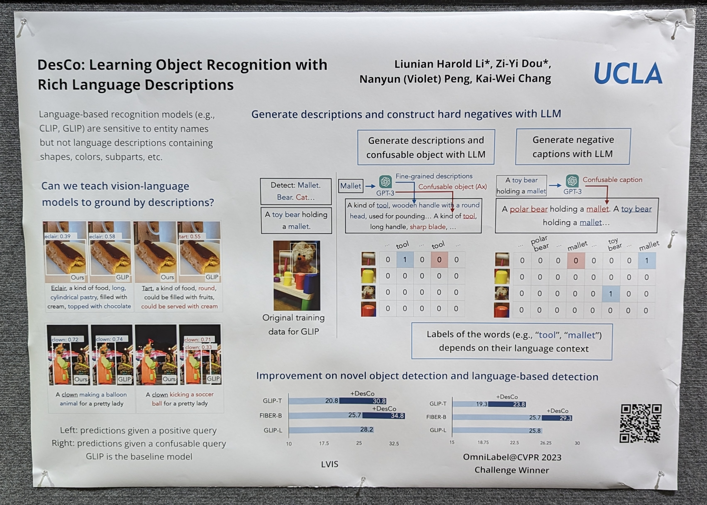
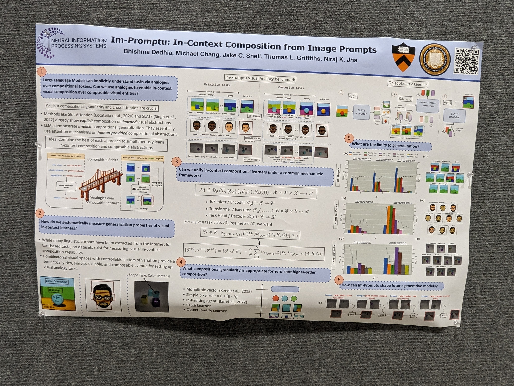
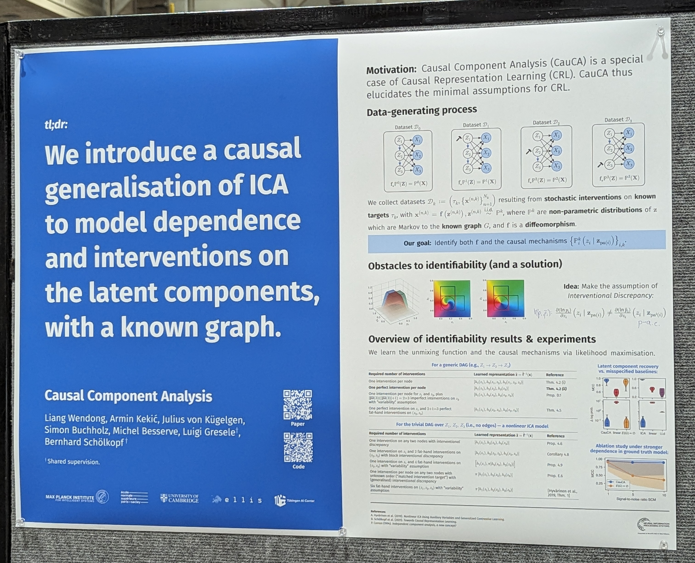
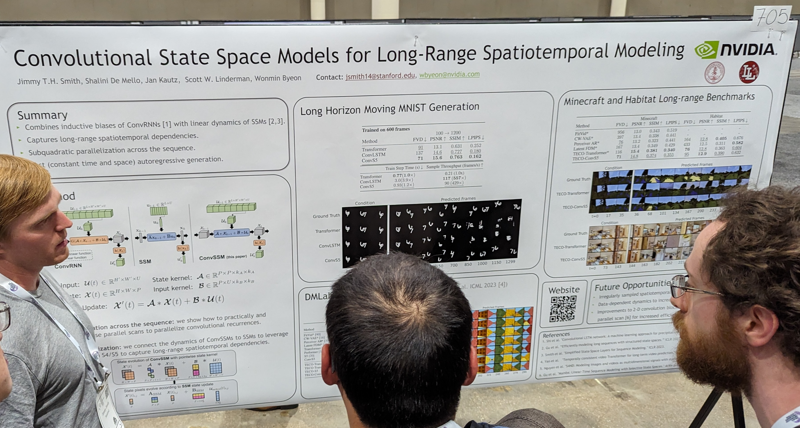
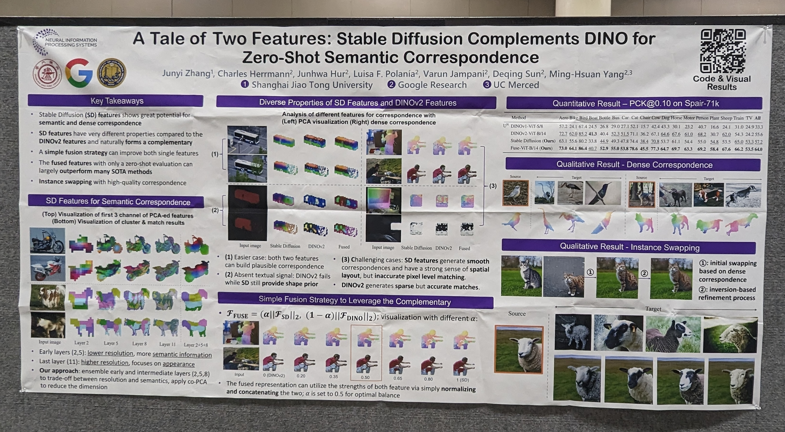
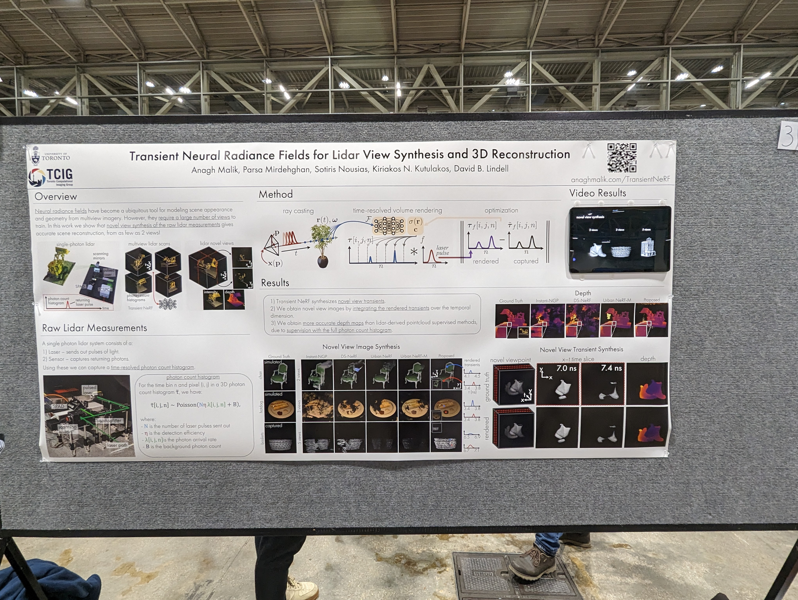
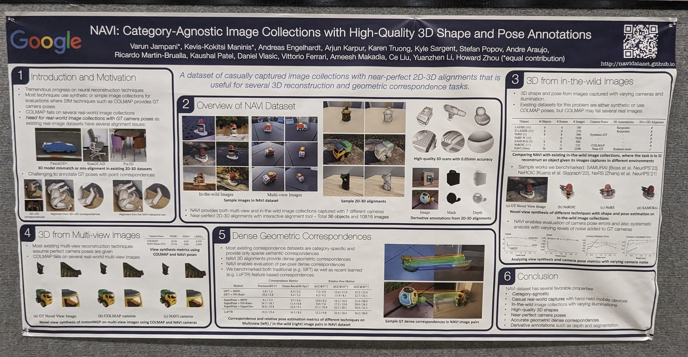
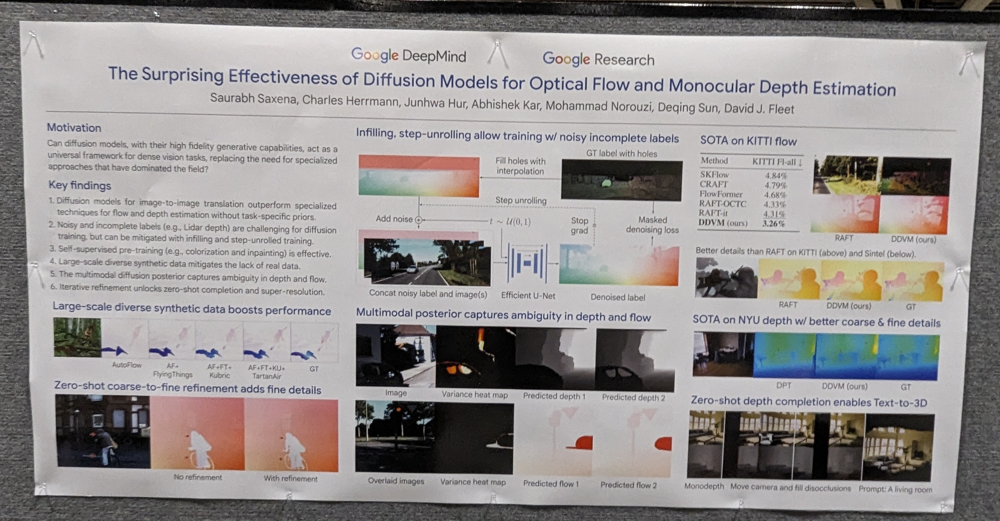
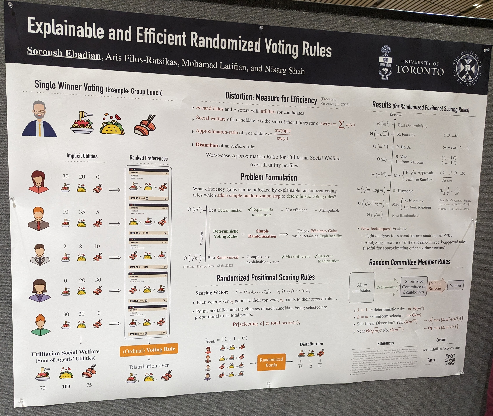

# NeurIPS 2023 Recap

@rkabra

This is a slice of topics I’ve been interested in of late, including VLMs, scene understanding, object-centric representations, and generative models. The posters below reflect about 2% of NeurIPS. While I have attempted to capture what is trending, there are entire fields that aren’t reflected here. On the whole the conference was less hype-y than last year. There was a lot of focus on evaluation, new ways of using existing models, and generating new data.

### Text-image alignment, attribution, and synthetic data {#text-image}

[DreamSim](https://dreamsim-nights.github.io/): introduces a human-judgment dataset called NIGHTS to capture “mid-level perceptual similarities.” The dataset is collected using a two-alternative forced choice given a reference image. An ensemble of CLIP, OpenCLIP, and DINO is LoRA-tuned on NIGHTS, showing an increase in the DreamSim perceptual metric. 

Cycle consistency for diffusion models–they derive a set of losses which can be used on unpaired data. Method: they pass in x_0 to enable “reconstruction,” which allows driving away from a given class. 

Attack to alter images imperceptibly so VLMs (MiniGPT-4, BLIP-2) are totally confused when captioning them. Uses a transfer-based attack to maximize similarity of adversarial image, followed by a query-based attack to further maximize similarity between generated caption and target string.

Text-image alignment and improved compositional prompting. The DA-Score evaluates alignment using VQA feedback. The proposed Eval-and-Refine method improves alignment and is model-agnostic; it works with Stable Diffusion XL.

[LANCE](https://virajprabhu.github.io/lance-web/): Synthetic image generation by structured prompt variation.

“Guided imagination” to expand small datasets. They perturb latent features, optimizing the perturbation to maximize “class informativeness” and a KL-based sample diversity score.

Ask GPT to generate confusing descriptions for better negative examples. They use fine-grained (LLM-generated?) descriptions as true positives. Those aren't verified but are supposedly innocuous. Perhaps there's a risk true positives are wrong and the generated negatives are true? Not convinced how well this can work, but the authors won a CVPR challenge.

Text-image alignment benchmark. Uses an NLI entailment model at Google (Q-squared).

Diffusion self-guidance showing impressive ability to make compositional corrections in generated images.

Compositional image generation allowing style transfer, negative prompting, etc. New benchmark MCC-250. Image fidelity and text-image alignment measured using FID and CLIP.

First instruction-following VLM called Llava. Helps improve factuality.

An object-centric benchmark to assess generated images for text-image alignment. They study multiple compositional tasks including attribute binding but also counting, position, colors. They show high agreement with human judgment, better than a SoTA CLIPScore. And they show diffusion models are still bad, particularly with position. DeepFloyd IF-XL was the best model (even relative to Stable Diffusion XL).

[UniSim](https://universal-simulator.github.io/unisim/), a video diffusion model which can “simulate realistic experience” of humans/agents interacting with their environment. Can simulate both high-level (e.g., open the drawer) and low-level instructions (e.g., move to x,y). Can be used to train both vision-language planners and low-level RL policies.

Open-vocabulary part segmentation. They clean and relabel the Pascal-Part and ADE20K-Part datasets.

Quantifying image difficulty based on human viewing time to identify category. They show images to participants for 17ms, 50ms, etc and collect 7 responses. When the majority of participants get it right, that is the MVT. Since this is correlated with VLM performance, do we need to run this exercise again in the future? The authors show CLIP ViT models have the best performance on the hardest images. The authors also mentioned ImageNetX, which comes with labels for lighting and other conditions.

Two-object attribute binding: What proportion of feature combinations/”rules” do models need to be trained on to be able to generate the full feature space. They test CNN and ViT based encoders, either using Slot Attention or just a VAE. The hardest version is on ClevrTex.

LLMs are great at scoring object-level text-to-image generation!

Augmentation to increase dataset diversity while maintaining visual consistency. Utilizes captioning models/LLMs to “extract task-agnostic concepts from training data.” Then augments the training data via language-guided image editing. “To maintain data integrity, a model trained on the original dataset filters out minimal image edits and those which corrupt class-relevant information.”

A captioning benchmark/dataset. The authors collect human data using a rating game to achieve community consensus. The aim is to ensure objects, global context, and actions are correctly described in the caption. This produces a caption dataset called VICR. The authors further train a baseline ViLBERT model on VICR and an existing Flickr8k-Expert dataset. VICR training outperforms on all metrics including BLEU, METEOR, ROUGE, and CLIPScore. 

Cola: A benchmark to test object attribute binding with hard distractors. Derived from GQA/Visual Genome. The authors advocate multimodal adaptation (i.e., fine-tuning the cross-attention layers) over tuning other parts of the network.

Measuring visual perception alignment between humans and models. They take into account cases when humans will abstain from prediction. In uncertain cases, they expect models to imitate human judgements. 

Multimodal Information Bottleneck for attribution. Outperforms other methods like GradCAM, Saliency, KernelSHAP, RISE, Chefer et al to attribute CLIP on CC and MS-CXR images. 

### Objects/slots/segments {#objects-slots-segments}

SOLV: Object discovery on real life videos (YouTube) without any additional modalities. They compare with the SoTA, DINOSAUR.

VideoSAUR: combines Recurrent Slot Attention with DINOSAUR and adds a temporal similarity loss. Outperforms STEVE on MoVI-E but perhaps slightly worse than SOLV (above)?

In-context compositional generation using cross-attention between slots and analogy-based instructions.

Cross-attention over slot attention slots can work if diffusing over a pretrained CNN latent space. Plus clustering all slots can produce an interesting concept library (except number of clusters needs to be set).

SAMCLR––use SAM segments to sample views for contrastive learning. This helps ensure crops contain sufficient (semantic) overlap.

Rotating features––inspiration from neuroscience where magnitude indicates presence of feature while orientation captures semantics. Does not solve BinarizedMNIST. Also did not try spherical features only. 

Reusable Slotwise Mechanisms evaluated on CLEVRER and Physion. Compared with SwitchFormer, SlotFormer, and NPS (but also similar to Recurrent Independent Mechanisms?). They emphasize the role of a communication bottleneck between slots.

A novel self-supervised framework and model mimicking the mutual exclusivity bias from developmental psychology. Supports multi-object multi-view representation learning, and novel classes (as opposed to object discovery).

Explicit symbolic labeling helps generalization on relational composition. The authors predict the next image on a Sticky Shapeworld dataset.

A study of occlusions in video action detection. They have 9 severity levels based on background and foreground complexity. They show emergent segregation in capsules.

### Contrastive learning {#contrastive}

Contextual pretraining using a buffer of data enables semantic segmentation, depth prediction, and in-context decoding via retrieval.

FactorCL: Contrastive learning taking into account shared and unique information between X1 and X2. They propose using a conditional InfoNCE lower bound to include information and conditional CLUB upper bound to exclude information.

A comparison of video contrastive (MoCo and SimCLR), non-contrastive (BYOL, SimSiam, DINO), generative, and supervised methods under distribution shifts affecting content, viewpoint, actor, etc. Contrastive or Siamese methods learn better viewpoint invariance.

Implicit contrastive learning using an asymmetric loss between a source encoder and target encoder (stop-gradient). The asymmetry helps push negative examples apart “in the service of pull”.

### Other Theory {#other-theory}

[Best paper] Mirage. Emergence by scaling is a phenomenon of tracking nonlinear metrics such as accuracy. With smoother metrics, performance scales smoothly as a function of model size.

Fine-tuning by preserving the pairwise angle of weights rather than additive LoRA. This seems like a more constrained form of fine-tuning, but the authors showed it's enough to fine-tune this way from random weights! The hypersphere energy has been shown to charecterize generalization. They also have new work on language models.

Tree of Thoughts implements deliberate problem solving via search in LLMs. 

Tree VAEs to enable hierarchical clustering. The tree structure is discovered using an iterative growing schedule.

Identifiability theory for nonlinear ICA: what structural sparsity assumptions lead to identifiability of the generative process given independent sources.

Causal generalization of ICA.

An assessment of the permutation conjecture when pretrained ReLU convolutional filters are flipped (horizontally mirrored). They compare data augmentation and the use of an invariance loss versus the perfect baseline (a graph conv network, GCN). Flipped features are not perfectly equal, suggesting it would make sense to average outputs when permutation equivariance is desired.

Quantifying the extent to which Graph NNs model interaction between vertices. This leads to an edge sparsification algorithm with performance benefits.

Convolutional State Space Models: help improve long horizon moving MNIST generation over 600 frames. Also evaluated on Minecraft and Habitat long-range benchmarks.

### 3D {#3d}

A 3D feature extractor based on three different methods to inject 3D information into LLMs: features from direct reconstruction (of point cloud and images), grandSLAM, and NeRFs. On the language side, they generate language data using a pipeline based on ChatGPT and BLIP. Evaluation on ScanQA. 

[Fusing Stable Diffusion and DINO](https://sd-complements-dino.github.io/) features followed by zero-shot evaluation can outperform SoTA methods on dense and semantic correspondence tasks.

Autodecoding to learn latents to diffuse on for 3D voxel diffusion. Evaluation based on FID only because they didn't want to reconstruct objects. Some normalization trick involving the median and IQ distance to make stats of 3D diffusion latents look better. MVImgNet contains real objects but might still be partial views because the objects are placed against something during imaging.

sVORF: Slot-guided volumetric radiance fields. (Follow up on uORF?). Impressive segmentation of CLEVR shadows.

[Differentiable Blocks World](https://www.tmonnier.com/DBW/): represent shapes from multi-view images using primitive blocks.

[PrimDiffusion](https://frozenburning.github.io/projects/primdiffusion/): Diffusion on volumetric primitives to generate 3D humans. Also permits texture transfer (e.g., clothing) and 3D inpainting.

Supervising on raw Lidar (photon histograms) is better than simple depth-supervised Nerf. It helps distribute radiance over the full distribution of depth rather than targeting a specific depth. One caveat is all photon data was collected in a dark room.

A modular look at 3D-aware image synthesis. They look at point embedding, feature decoding, volume rendering, upsampling, and pose sampling techniques separately. They reproduce models from 2020-2022, showing EG3D was a huge improvement over previous models. They show “volume” point embedding alone (over MLP or Tri-plane representations) gives the best FID on Cats and Cars, while being competitive on FFHQ.

OpenMask3D: takes posed RGB-D frames and a reconstructed 3D geometry to produce open-vocabulary 3D instance segmentations. They first get class-agnostic masks, then compute mask features by taking top-k views, and finally use CLIP to query all 3D instances.

3D room layout generation from RGB video and “manual 2D annotations of structural elements and their visible parts” (just segmentations?). The method combines point tracking, edge matching, and perpendicularity constraints. The authors release a video and CAD dataset called CAD-Estate.

NAVI: a dataset of multi-view and in-the-wild image collections of 36 objects and 10k images. The authors show an improvement over using COLMAP poses. By aligning to 3D, they also provide dense geometric correspondences. 

An extension of EPIC Kitchens with 3D geometry (pointclouds and cameras) for 19M frames. Includes VISOR annotations for segmenting objects and hands.

Virtual objects pasted into real scenes, with 3D bounding boxes and plausible physical locations. This synthetic data helps achieve SoTA on monocular 3D detection.

Planning over partially observed 3D scene graphs using language models. The method PROPHE-C is based on MC trajectory sampling to hallucinate possible 3DSGs.

Diffusion over articulation trees (graphs) to generate articulated objects.

### Diffusion and GANs (for images) {#diffusion-and-gans}

Text-to-panorama generation using synchronized joint diffusions. They compute the coherence for multiple diffusion processes in _advance_.

Diffusion on bounded ranges using beta distributions in both directions. Optimized using KL-divergence upper bounds rather than reweighted ELBOs. They also compare with categorical or count-based diffusion processes.

Precision-recall curves for generative models. Each point on Fig 1(b) is a f-divergence that can be optimized. We might choose a specific one based on the quality/diversity trade-off we’re looking for.

Particle-based framework to unify GANs and score-based diffusion. They study particle models with and without generators (which enable interaction of particles) versus various gradient vector fields that the generated particles may follow: Wasserstein, Log Ratio, and Discriminator-based.

Classification using diffusion models using a labels x timesteps score matrix and timesteps weighting function.

Reweighted diffusion losses (which look different from the ELBO) can be seen as ELBO + additive Gaussian data augmentation.

Diffusion models for dense vision tasks. Using large-scale synthetic data boosts performance. Evaluation on KITTI flow and NYU depth.

### Concepts and disentanglement {#concepts-disentanglement}

Multiple classification taxonomies on CLEVR. MAEs perform the worst on unsupervised clustering (of frozen features) on shape. All models are bad at counting––it’s better to train a ResNet from scratch.

Concept algebra as an alternative to prompt tuning to generate images. Every prompt induces a concept distribution which can be mapped to a vector space. Concepts are then modified on their own subspaces.

Concepts as dictionary learning and concept importance as attribution to image pixels. Measures like TCAV and Sobol. Visualization of concepts (e.g., what makes an espresso) available [in this demo](https://serre-lab.github.io/Lens/). 

Quantization works better than regularization to learn disentangled latent representations?

A theory of compositional generalization. The claims are: it requires a compositional support (i.e., training set supporting all configurations) that is also sufficient (i.e., enables reconstruction of all components).

### Fun/novelties/new datasets {#novelties}

Tracking human positions based on the acoustic profile of the room.

A fun dataset of chimpanzee actions/behaviors. Permits detection, pose estimation, and spatiotemporal action detection.

Efficiency gains in voting unlocked using an explainable randomization step added to deterministic voting rules.

Geographically diverse images per object class compared to ImageNet. They identify gaps in model performance (ResNet50, CLIP) from region to region. They also train models on their dataset, and show improvements when testing on a different geo-diverse dataset.

DataComp: a large-scale multimodal dataset that outperforms LAION.

# Workshops

Object placement in scenes by first hallucinating scenes around objects. A model is trained to calculate placement plausibility based on positive (generated) examples and negative (bad crop) examples. The model can be run on grid points on the target scene to find the best object placement. 

DA-Fusion: dreambooth style tokens which allow generating variations of an image for data augmentation. Keeping the token fixed, it is possible to alter the image latent at some stage t of the diffusion generative process.

Diffusion models do disentangle when shown only diagonal elements of a feature grid, if they are stopped early during training.

SAD: segmentation over RGBD by running SAM on colormap of depth, and then fusing with an OVSeg segmentation of the RGB image.

Distance Learner: a new paradigm (same vein as maximum margin?) for classification. Yields out-of-domain understanding because the classifier becomes more uncertain away from the data manifold.

Investigating shape bias in ResNets and ViTs. 

Synthetic data generation optimized using one-shot feedback from an existing classifier to balance classes. Improves classification performance (in a newly trained model) on underrepresented classes in ImageNet-LT and NICO++.

f-GANs settle scores: assuming optimal discriminators, they show the optimal generator must satisfy a score-based equality. The Reverse KL leaves only one term (based on the score) in the product. Better results on mode collapse using ScoreGAN.

# 

# Favorite talks

Chelsea Finn (Stanford) at SSL workshop on (1) improving factuality using “semantic entropy,” a model intrinsic quantity, and (2) dealing with cut-off dates using meta-learning (CAMELS) over new information.

Adji Bousso Dieng (Princeton) at SyntheticData4ML on Vendi scores to assess dataset diversity (better than averaging a similarity matrix).

Björn Ommer (LMU, StableDiffusion) keynote on capturing long-range dependencies (e.g., by diffusing on a latent space).

Linda Smith (IndianaU) keynote on how babies might learn long-tailed knowledge from one-shot episodic cues.

# Appendix

If you’re interested, I did a similar recap for ICML 2023 [here](https://docs.google.com/document/d/1MAqNClzFc3M-TF3hsAEBAKsWWq_9HKePHNsr-Onpm-4/edit?resourcekey=0-n0U_jh0FJoiRwCMOF_E3xA&tab=t.0#heading=h.pwkcigpvclvr).
